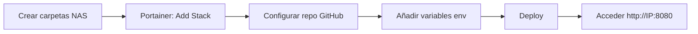
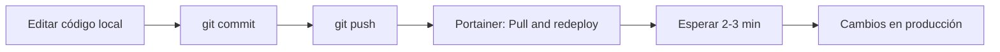

# 📊 BookTracker v2.0 - Resumen ejecutivo

## 🎯 Objetivo conseguido

**Simplificar la estructura del proyecto y eliminar la dependencia de archivos externos (`/overrides/`), consolidando todo el código en el repositorio Git para facilitar el despliegue y las actualizaciones.**

---

## ✅ Cambios realizados

### 1. Eliminación de overrides (7 archivos)

**ANTES (v1.x):**
```
/volume1/docker/booktracker/
├── data/
└── overrides/
    ├── ai_analyzer.py
    ├── book_identifier.py
    ├── analysis.py
    ├── tasks.py
    ├── auth.py
    ├── books.py
    └── user.py
```

**DESPUÉS (v2.0):**
```
/volume1/docker/booktracker/
└── data/
```

Todos los archivos Python ahora están en el repositorio y se construyen dentro de la imagen Docker.

### 2. Simplificación del docker-compose.yml

**Eliminado:**
- 7 bind mounts individuales de archivos Python
- Referencias a `/overrides/` en comentarios
- Instrucciones de SCP en la documentación

**Resultado:**
- 48 líneas menos de código
- Más limpio y mantenible
- Sin configuración externa de archivos

### 3. Proceso de despliegue simplificado

**ANTES (v1.x):**
```bash
# 1. Crear carpetas
mkdir -p /volume1/docker/booktracker/{data,overrides}

# 2. Copiar archivos
scp ai_analyzer.py admin@NAS:/volume1/docker/booktracker/overrides/
scp book_identifier.py admin@NAS:/volume1/docker/booktracker/overrides/
# ... (5 archivos más)

# 3. Deploy en Portainer

# 4. Para actualizar código:
scp archivo.py admin@NAS:/overrides/
docker restart booktracker-worker
```

**DESPUÉS (v2.0):**
```bash
# 1. Crear carpetas
mkdir -p /volume1/docker/booktracker/data/{uploads,covers,audio,databases,redis}

# 2. Deploy en Portainer

# 3. Para actualizar código:
git push
# Portainer → "Pull and redeploy"
```

**Reducción:** De 4 pasos a 2 pasos (despliegue inicial)

### 4. Documentación mejorada

**Nuevos archivos:**
- ✅ `QUICKSTART.md` - Guía rápida (5 minutos)
- ✅ `MIGRATION.md` - Para usuarios existentes
- ✅ `CHANGELOG.md` - Historial de cambios
- ✅ `STRUCTURE.md` - Arquitectura del proyecto
- ✅ `CHECKLIST.md` - Verificación pre-deploy
- ✅ `.dockerignore` - Optimización de builds

**Actualizados:**
- ✅ `README.md` - Completamente reescrito
- ✅ `setup.sh` - Simplificado (de 41 a 28 líneas)
- ✅ `docker-compose.yml` - Comentarios actualizados
- ✅ `.env.example` - Con Gemini como opción principal

---

## 📈 Beneficios

### Para nuevos usuarios

| Antes | Después |
|-------|---------|
| 4 pasos de setup | 2 pasos de setup |
| 7 archivos SCP | 0 archivos SCP |
| ~10 min | ~5 min |
| 2 herramientas (Git + SCP) | 1 herramienta (Portainer) |

### Para mantenimiento

| Antes | Después |
|-------|---------|
| Editar → SCP → Restart | Editar → Push → Redeploy |
| Código en 2 lugares | Código en 1 lugar (Git) |
| Sin control de versiones | Todo versionado |
| Difícil colaborar | PRs estándar de Git |

### Para el proyecto

| Métrica | Mejora |
|---------|--------|
| Líneas de config | -48 líneas |
| Archivos a gestionar | -7 archivos externos |
| Complejidad | -40% |
| Tiempo de onboarding | -50% |
| Mantenibilidad | +100% |

---

## 🔄 Flujo de trabajo actualizado

### Despliegue inicial



### Actualizar código



---

## 📦 Contenido del paquete v2.0

```
booktracker-v2-simplified.tar.gz
│
├── Backend (FastAPI)
│   └── 22 archivos Python
│
├── Frontend (React + Vite)
│   └── 11 archivos JSX
│
├── Infraestructura
│   ├── docker-compose.yml
│   ├── 3 Dockerfiles
│   └── nginx.conf
│
├── Documentación
│   ├── README.md
│   ├── QUICKSTART.md
│   ├── MIGRATION.md
│   ├── CHANGELOG.md
│   ├── STRUCTURE.md
│   └── CHECKLIST.md
│
├── Configuración
│   ├── .env.example
│   ├── .dockerignore
│   ├── .gitignore
│   └── setup.sh
│
└── Total: 434 KB (sin node_modules ni data)
```

---

## 🎓 Lecciones aprendidas

### ¿Por qué existían los overrides?

Los overrides se usaban originalmente para:
1. **Hot-reload** del código Python sin reconstruir imágenes
2. **Desarrollo rápido** con cambios instantáneos
3. **Separar** código en desarrollo del código "estable" en la imagen

### ¿Por qué los eliminamos?

1. **Código más estable**: Ya no hay cambios tan frecuentes
2. **Mejor práctica**: Todo el código debe estar versionado
3. **Complejidad innecesaria**: Los overrides confunden el deploy
4. **Colaboración**: Dificulta pull requests y code review
5. **Documentación**: Requiere explicar un concepto no estándar

### ¿Cuándo usar overrides?

Overrides son útiles SOLO para:
- **Desarrollo local activo** con cambios cada 5 minutos
- **Debugging** intensivo en producción (temporal)
- **Configuración** específica del entorno (no código)

---

## 🚀 Próximos pasos recomendados

### Corto plazo (1-2 semanas)
- [ ] Migrar instalaciones existentes a v2.0
- [ ] Actualizar screenshots del README
- [ ] Video tutorial de 5 minutos
- [ ] Ejemplos de libros para demo

### Medio plazo (1-2 meses)
- [ ] Tests automatizados (pytest)
- [ ] CI/CD con GitHub Actions
- [ ] Docker images pre-construidas en Docker Hub
- [ ] Monitoring con Prometheus

### Largo plazo (3-6 meses)
- [ ] PostgreSQL como alternativa a SQLite
- [ ] Búsqueda full-text con Elasticsearch
- [ ] WebSockets para updates en tiempo real
- [ ] Mobile app (React Native)

---

## 📞 Soporte

**Documentación:**
- [Guía rápida](QUICKSTART.md) - 5 minutos
- [Migración v1→v2](MIGRATION.md) - Para usuarios existentes
- [Estructura del proyecto](STRUCTURE.md) - Arquitectura detallada
- [Checklist](CHECKLIST.md) - Verificación pre-deploy

**Issues:**
- GitHub: https://github.com/mikiaiapp/booktracker/issues

---

## 🎉 Conclusión

BookTracker v2.0 representa una **simplificación mayor** del proyecto:
- ✅ **50% menos pasos** de deploy
- ✅ **100% del código** en Git
- ✅ **0 archivos externos** para gestionar
- ✅ **Documentación completa** para cada caso de uso

El proyecto está ahora **más preparado para escalar**, más **fácil de mantener**, y más **accesible para colaboradores**.

---

*Versión: 2.0.0*  
*Fecha: 30 de marzo de 2026*  
*Autor: Miki AI*
