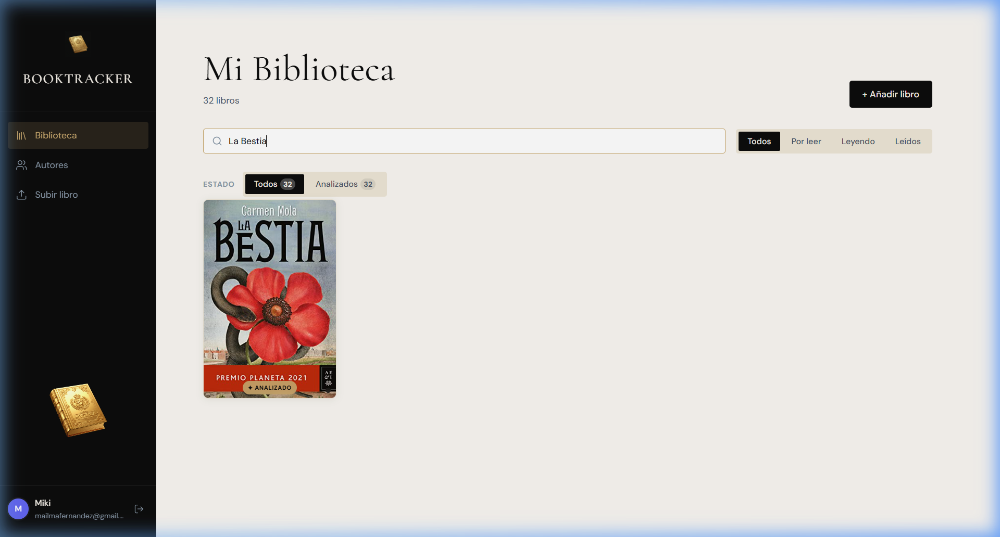
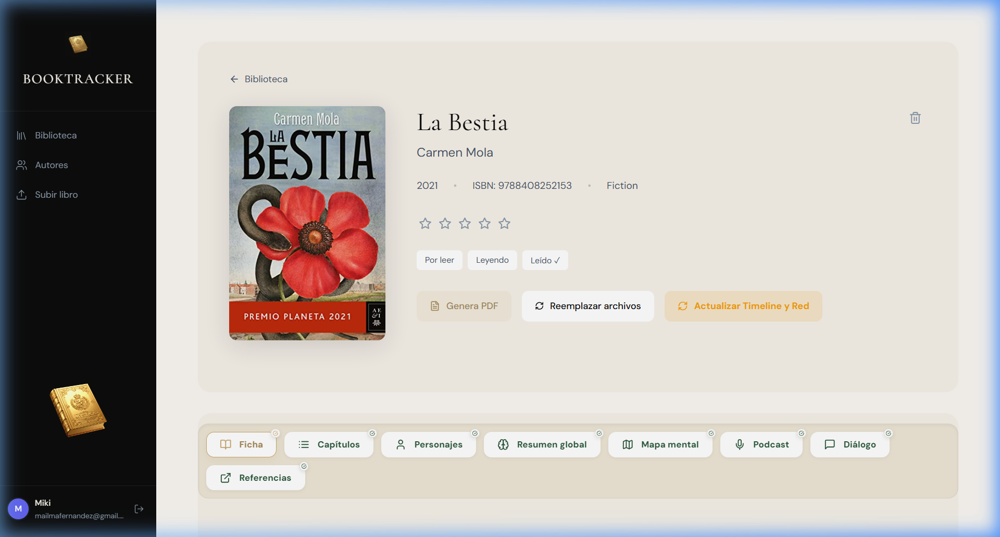
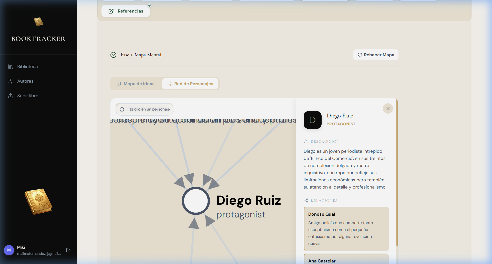
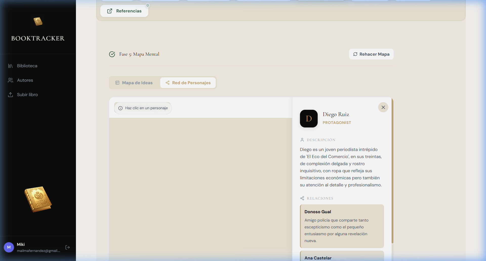

# 📚 Manual de Usuario: BookTracker Premium

Bienvenido a **BookTracker**, tu suite de análisis literario inteligente. Este manual te guiará a través de la instalación, la operativa diaria y el uso de las herramientas avanzadas impulsadas por Inteligencia Artificial.

---

## 1. Introducción y Conceptos Clave
BookTracker no es solo una biblioteca; es un puente entre tú y tus libros. Utiliza modelos de lenguaje de última generación (como Google Gemini) para "leer" tus obras y extraer datos que antes requerirían horas de estudio.

### ¿Qué hace BookTracker por ti?
1.  **Identificación Automática:** Solo sube un archivo y la IA buscará la sinopsis, el autor y la mejor portada disponible.
2.  **Estructura Narrativa:** Desglosa el libro en capítulos y resume cada uno individualmente.
3.  **Red de Personajes:** Mapea las relaciones y la psicología de los protagonistas.
4.  **Podcast Literario:** Genera un episodio de audio donde dos expertos analizan tu libro.
5.  **Diálogo Directo:** Chatea con el libro para resolver dudas específicas.

---

## 2. Guía de Instalación (Windows)
Para usuarios que desean ejecutar la aplicación localmente en su PC.

1.  **Instalar Docker Desktop:** Descárgalo desde [docker.com](https://www.docker.com/). Es el motor que permite que BookTracker funcione sin configuraciones complejas.
2.  **Lanzar la Aplicación:** Abre la carpeta del proyecto y haz doble clic en `BOOKTRACKER.bat`.
3.  **Acceso:** El navegador se abrirá automáticamente en `http://localhost:8081`. **No cierres la ventana negra** mientras uses la aplicación.

---

## 3. Configuración de la IA (Primeros Pasos)
Antes de analizar tu primer libro, debes configurar tu "llave" de acceso:
1.  **Registro:** Crea una cuenta de usuario local.
2.  **Ajustes de IA:** Haz clic en tu nombre en la esquina inferior izquierda y selecciona "Ajustes de IA".
3.  **API Key:** Introduce tu clave de **Google Gemini** (recomendado por su velocidad y capacidad). Puedes obtener una gratuita en [Google AI Studio](https://aistudio.google.com/).

---

## 4. Operativa de Análisis
Cuando subes un libro (botón "+" en la pantalla principal), este entra en una "Tubería de Análisis" que consta de 6 fases:

### Fases del Proceso
*   **Fase 1: Ficha y Autor:** Identifica el libro y busca información externa.
*   **Fase 2: Estructura de Capítulos:** Divide el texto y genera resúmenes individuales.
*   **Fase 3: Análisis de Personajes:** Extrae la lista de personajes y define sus roles y relaciones.
*   **Fase 4: Resumen Global:** Genera un ensayo completo sobre la obra.
*   **Fase 5: Mapa Mental:** Crea la estructura visual de ideas.
### Ficha del Libro

> [!TIP]
> Puedes pausar, cancelar o reintentar cualquier fase si detectas que la IA ha omitido algún detalle importante.

---

## 5. Herramientas Avanzadas

### Red de Personajes e Ideas

*   **Interacción:** Pulsa sobre cualquier círculo en el mapa para abrir el **Panel de Detalles**. Aquí verás la descripción psicológica del personaje y con quién se relaciona.
*   **Mapa Mental:** Usa la pestaña "Mapa Mental" para ver un esquema jerárquico de las ideas principales del libro, con ramas que puedes expandir o contraer.

### Línea de Tiempo y Podcast

*   **Línea de Tiempo:** En la pestaña "Capítulos", activa la vista de "Línea de Tiempo" para ver un recorrido visual por los hitos del libro.
*   **Podcast:** En la pestaña "Podcast", puedes escuchar el análisis generado o descargar el archivo MP3 para llevarlo en el móvil.

---

## 6. Solución de Problemas
*   **El análisis se detiene:** A veces las cuotas de IA se agotan temporalmente. La aplicación reintentará automáticamente cuando la cuota se resetee.
*   **No aparece la portada:** Puedes usar el botón "Cambiar portada" en la ficha del libro para buscar imágenes alternativas en Google Books.

---
*Manual generado por Antigravity para BookTracker v2.0*
